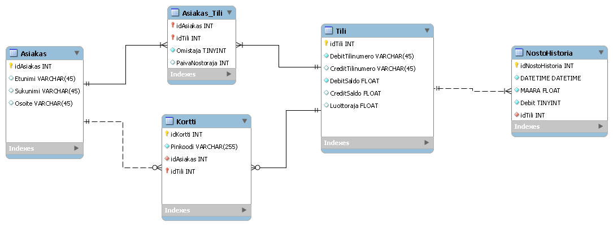
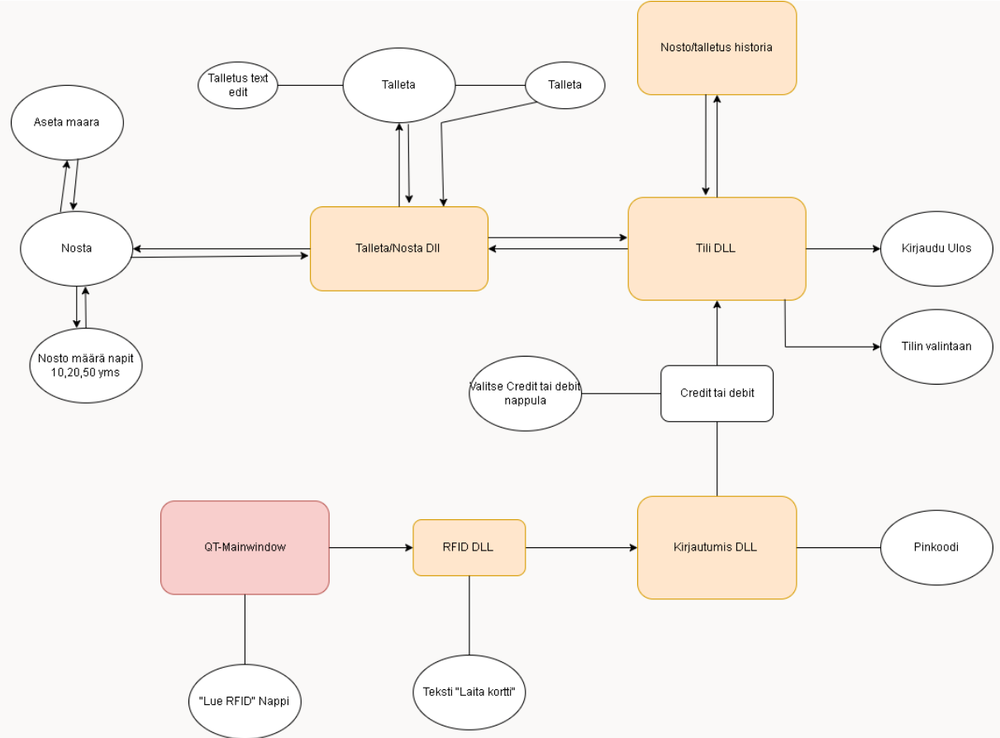
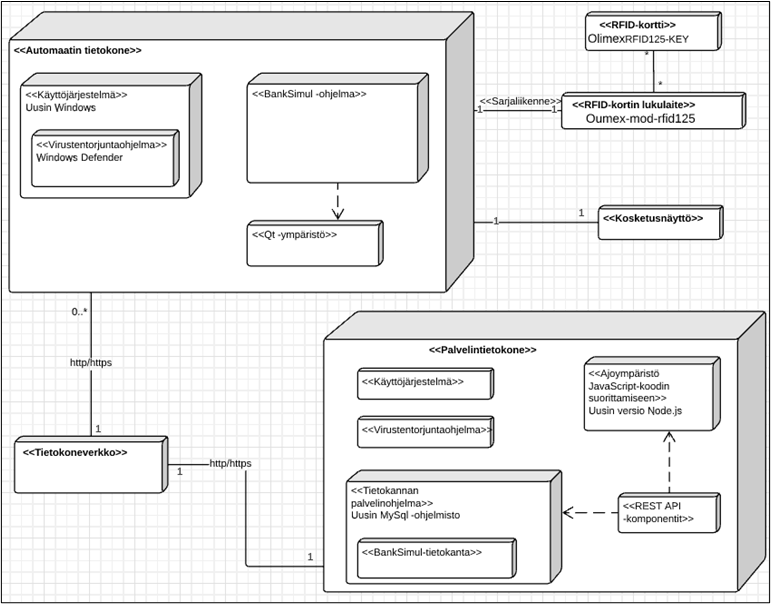
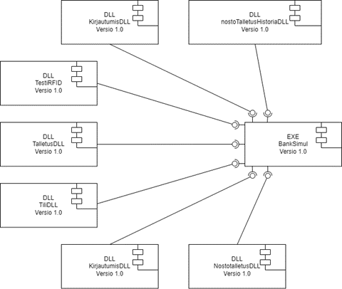

# group_5

My task was to implement a withdraw function to the simulator.
This included doing some work on both frontend and backend.
Frontend | (NostoTalletusDLL) + related Slots and post/put functions in MainWindow
Backend  | (asiakasTili, creditSaldo, debitSaldo)

## ER- Kaavio
Projektin ER- Kaavio on seuraavanlainen

Projektin UI- Suunnitelma on seuraavanlainen

Projektin Järjestelmäarkkitehtuuri on seuraavanlainen

Projektin Komponenttikaavio on seuraavanlainen

